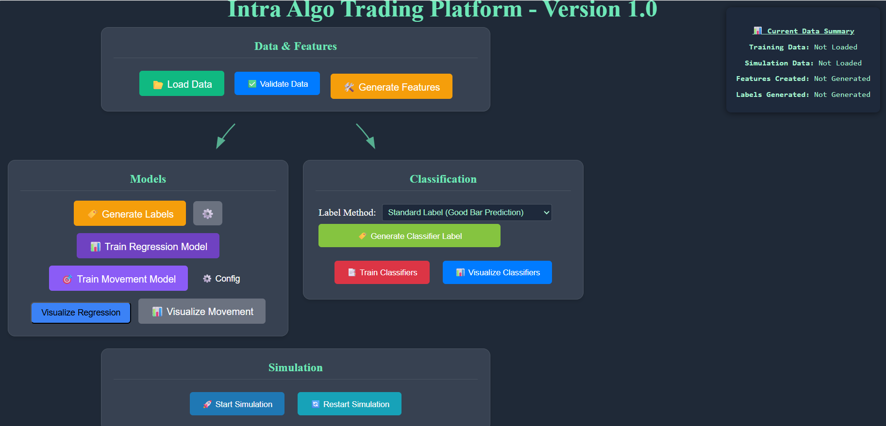

# Investment Intelligence Agent

An AI-powered personal market assistant designed to support informed, low-risk trading decisions.  
The system combines **machine learning**, **large-language models**, and **vision-based chart understanding** to generate insights, evaluate strategies, and interpret market structure across multiple trading styles.

---

## 📌 Overview

The Investment Intelligence Agent brings together predictive modeling and AI-driven market research into a single, cloud-accessible interface.  
It analyzes charts, identifies opportunities, recommends strategies, and evaluates performance—helping traders make data-backed decisions using small risk factors.

The platform works entirely with user-provided chart images and CSV data, producing structured insights, suggested actions, and visual performance evaluations.

---

## 🧠 Core Capabilities

### 🔍 Vision-Based Chart Intelligence
- Reads uploaded chart images using advanced vision models (OpenAI & Gemini).  
- Identifies trend structure, support/resistance, volatility shifts, and key price zones.  
- Extracts contextual market information to support strategy decisions.
---

### 📈 Predictive Modeling Engine (ML)
- Generates technical features and training labels from uploaded intraday data.  
- Trains forecasting models that produce short-term directional and magnitude predictions.  
- Provides performance charts, error analysis, and evaluation metrics.

---

## 📊 Strategy Bank (VWAP Strategy Selector)

A curated collection of VWAP-based strategies that can be evaluated on demand.

- The agent ranks strategies based on chart conditions.  
- Provides explanations for each recommendation.  
- Suggests parameter ranges and expected behavior.  
- Users can optionally review optimization results after running a strategy.

---

## 🧱 VWAP Renko Agent

A specialized fixed-logic analyzer for Renko-based VWAP setups.

- Highlights reclaim, bounce, and continuation patterns on Renko charts.  
- Identifies potential entry regions and risk zones.  
- Focuses on structural clarity and simplicity—no optimization step.

---

## 📘 Swing Agent

A structured swing-trading evaluator inspired by professional multi-day analysis.

- Accepts chart uploads across higher timeframes.  
- Interprets long-term structure, momentum, and trend strength.  
- Produces swing bias and areas of interest based on predefined criteria.  
- Works across both OpenAI and Gemini models.

---

## 📰 Daily Market Summary

Generates a compact morning briefing with:

- Market bias  
- Sector performance  
- Economic events  
- Notable news  
- Symbol-level highlights  

---

## ☁️ Cloud Access

The system was deployed to a private cloud environment(in gcp), enabling secure access.

---

## 🚀 How It Works (High-Level Workflow)

1. **Upload chart images or CSV data**  
2. **Agent interprets structure using vision + LLM reasoning**  
3. **Predictive engine evaluates or forecasts price movement**  
4. **Strategy Bank or VWAP Renko produces actionable suggestions**  
5. **Optional: Optimization and performance review**  
6. **Summary and insights delivered in a clean, structured format**

---

## 💡 Summary

The Investment Intelligence Agent is a unified research and analysis platform combining:  
- AI-driven chart interpretation  
- Strategy evaluation  
- Predictive modeling  
- Swing and intraday idea generation  
- Cloud-based accessibility  

It demonstrates practical integration of ML, LLMs, and trading domain knowledge into one cohesive system.

---

