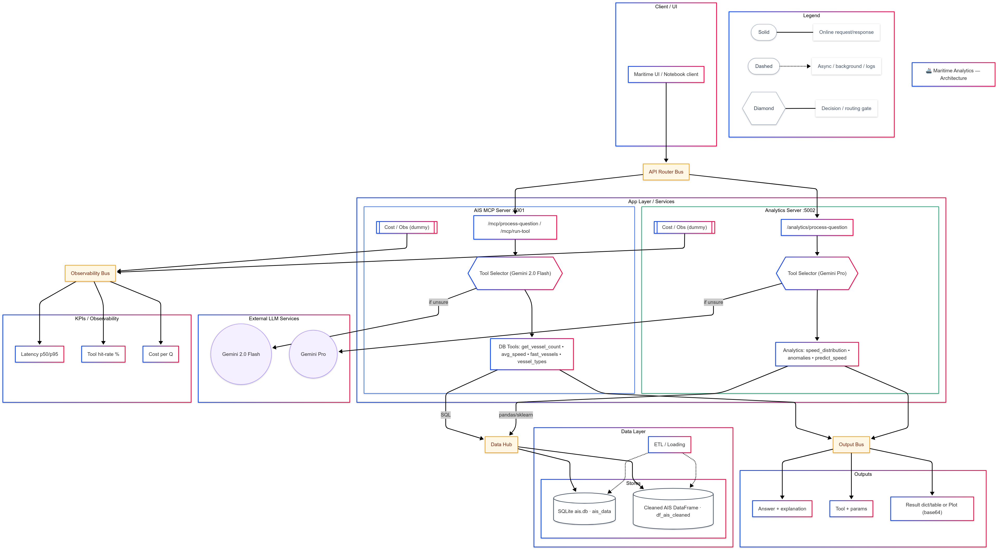
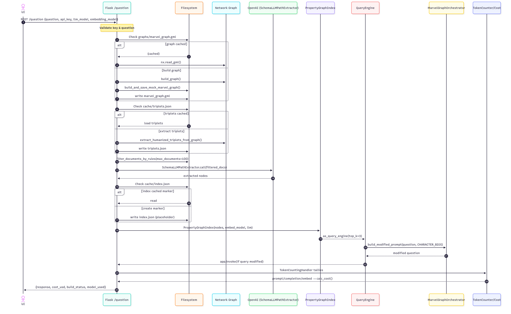

# Player Behavior AI

An analytics assistant that answers questions about gameplay and survey data by routing requests to the right toolchain:

- **Aqualab path (MCP :8000):** SQLite helpers over the `aqualab.db` telemetry.
- **Behavior path (MCP :8010):** CSV/EDA helpers over Google Analytics–style survey/events.
- **Fallback summarizer:** if no tool matches, generate a brief natural-language summary.

The system emphasizes **clear, verifiable answers** with **real token-based cost tracking** and **latency observability**. Tool selection is handled by **Gemini**.

---

## Example questions it can answer

- “What % of players churned after level 3 last week?”
- “Top 5 sessions by total playtime in the Aqualab dataset.”
- “Show the distribution of session lengths for new users.”
- “Given a CSV segment, summarize behavior differences between group A vs B.”

---

## Architecture

**Flow (high level)**

1. **Client** → **API Router**.  
2. Router forwards to either:
   - **Aqualab MCP :8000** → *Selector (Gemini)* → **SQLite helpers** → `aqualab.db`.
   - **Behavior MCP :8010** → *Selector (Gemini)* → **CSV/EDA tools** (`gaming_behavior_tools.py`).
3. If no tool fits, **Fallback summarizer** returns a concise answer.
4. Results flow through the **Output Bus** (answer + tool + result/params) and logs go to **Observability** (latency, cost).
5. **External LLM (Gemini 2.0 Flash)** is used by selectors and the fallback summarizer.

---

## Request/Response Sequence

Alternate sequence export

**What the diagram shows**

- **Behavior path:** validate/normalize → select CSV tool → run with params → return rows/summary.  
- **Aqualab path:** validate/normalize → select SQLite tool → run SQL → return rows/aggregates.  
- **No match:** fallback summarizer generates a short answer.  
- All routes log **latency** and **cost**.

---

## Key Highlights

- 🔀 **Dual routing:** CSV/EDA tools for survey/GA-style data; SQLite helpers for telemetry (`aqualab.db`).  
- 🤖 **Selector-driven:** Gemini picks the best tool for each question; a fallback summarizer covers edge cases.  
- 🔎 **Transparent outputs:** each response includes **tool name**, **params**, and **table/summary** (or fallback text).  
- 📈 **Observability:** logs **latency p50/p95**, **tool hit-rate %**, and **cost per query** for tuning.  
- 🧩 **Modular design:** UI, router, two MCP services, data layer, external LLM, and observability buses.

---

## Tools & Frameworks

- **Python**
- **SQLite** (`aqualab.db`) for gameplay telemetry
- **pandas** for CSV/EDA utilities
- **Gemini 2.0 Flash** for selection + fallback summarization
- **Mermaid** for architecture/sequence documentation

---

## Notes

- Cost tracking is **computed from real token usage** (prompt + completion) multiplied by an **explicit price table** per model (from vendor docs).  
- CSV/EDA tools live in `gaming_behavior_tools.py`; SQLite helpers run parameterized queries against `aqualab.db`.

---

[⬅ Back to Portfolio Home](README.md)
