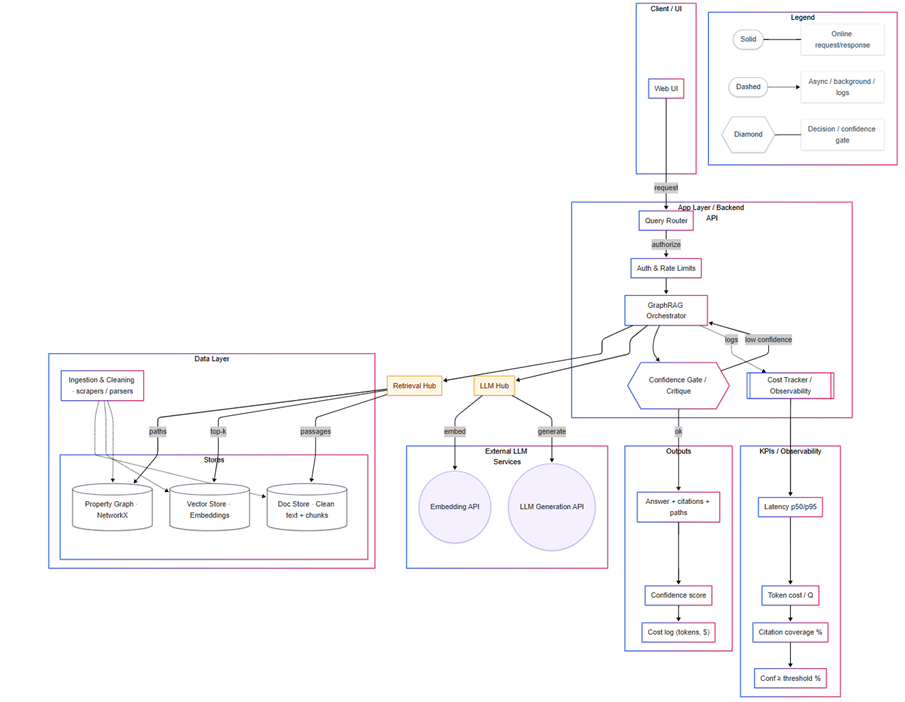
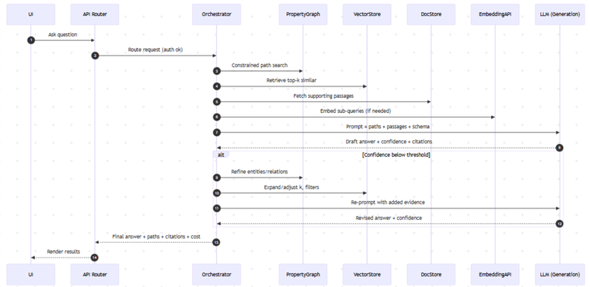

# GraphRAG Knowledge Orchestrator

## Overview
[1–2 short paragraphs introducing the project in simple terms + buzzwords]  

## Example Use Cases
- Trace relationships between entities in a knowledge graph.  
- Answer “What events connect X and Y?” with supporting evidence paths.  
- Summarize context across documents with citations.  
- Compare how multiple sources describe the same entity.  

## Architecture Diagram
  

## Sequence Diagram
  

## Key Highlights
- 🔎 Graph-based retrieval with **NetworkX** + **ChromaDB** + **SQLite**.  
- ⚡ Confidence feedback loop with re-prompting for low-confidence answers.  
- 🤖 LLM orchestration with **OpenAI APIs** (embeddings + generation).  
- 📊 Observability: latency, token usage, and cost tracking.  
- 🧩 Modular design: UI, router, orchestrator, retrieval hub, external LLMs.  

## Tools & Frameworks
- **Python**  
- **NetworkX** (graph structure + path search)  
- **ChromaDB** (vector store for embeddings)  
- **SQLite** (document storage)  
- **OpenAI APIs** (embeddings + generation)  
- **pandas / sklearn** (lightweight analytics + evaluation)  

---

[⬅ Back to Portfolio Home](README.md)
