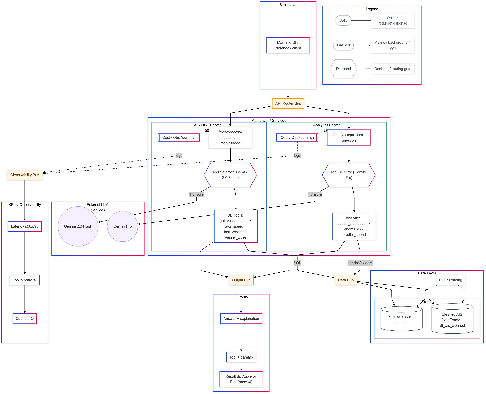
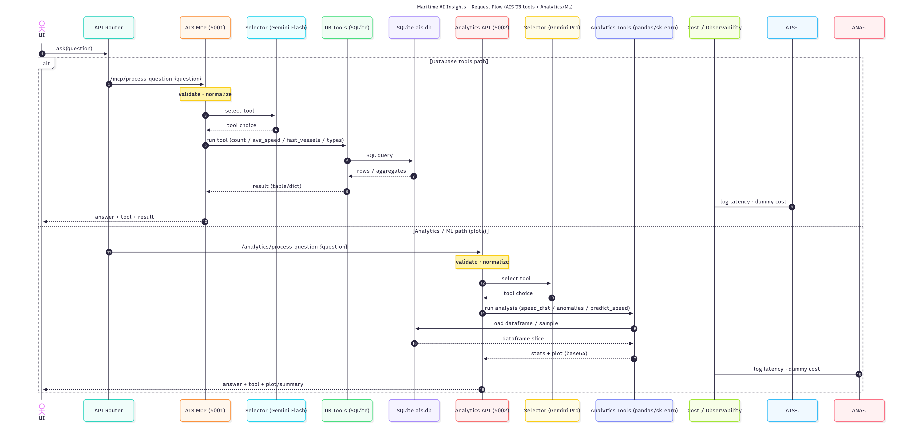

# Maritime AI Insights

A lightweight system that answers questions over AIS-style vessel data using two paths:

- **DB tools path (AIS MCP :5001):** runs parameterized SQL helpers over a local SQLite dataset.
- **Analytics/ML path (Analytics API :5002):** runs pandas/sklearn analyses and returns plots (base64) plus a short summary.

The goal is **clear, verifiable answers** with **cost/latency observability** and the flexibility to route requests via **Gemini-based selectors** (Flash/Pro).

---

## Example questions it can answer

- “How many distinct vessels reported in the last 24 hours?”
- “Which vessel types have the highest average speed this week?”
- “Show a speed distribution plot for cargo ships departing Rotterdam.”
- “Detect potential anomalies in reported speeds for MMSI X over the last 7 days.”

---

## Architecture

**Flow (high level)**

1. **Client** (UI/Notebook) sends a question → **API Router**.
2. Router forwards to either:
   - **AIS MCP :5001** → *Selector (Gemini Flash)* → **DB Tools** (e.g., `get_vessel_count`, `avg_speed`, `fast_vessels`, `vessel_types`) → SQLite.
   - **Analytics API :5002** → *Selector (Gemini Pro)* → **Analytics Tools** (pandas/sklearn: `speed_distribution`, `anomalies`, `predict_speed`).
3. Both paths write to an **Output Bus** (answer + tool + result/plot) and log to **Observability** (latency, dummy cost).
4. **ETL/Loading** maintains **SQLite `ais.db`** and an optional cleaned **DataFrame** for analytics.

---

## Request/Response Sequence

**What the diagram shows**

- The **DB tools path** validates & normalizes, selects a tool, executes SQL, aggregates rows, and returns a table/dict with the selected tool name.
- The **Analytics path** validates, selects an analysis, samples/loads a DataFrame, computes stats/plot, and returns a summary + base64 plot.
- Both paths log latency and a **dummy cost** to the observability sink.

---

## Key Highlights

- 🔎 **Two-path routing:** DB helpers for fast counts/aggregates; analytics tools for distributions, anomaly flags, and simple predictions.
- 🤖 **Selector-driven:** Gemini **Flash** (DB path) and **Pro** (analytics path) choose the most appropriate tool per question.
- 📊 **Transparent outputs:** each response includes the **tool name**, **parameters**, and **tabular results** or a **plot**.
- 🧭 **Observability:** logs **latency p50/p95**, **tool hit-rate %**, and **cost per query** (dummy tracking) for tuning.
- 🧩 **Modular:** UI, router, MCP services, data layer, and external LLMs are cleanly separated.

---

## Tools & Frameworks

- **Python**
- **SQLite** (`ais.db`) for structured vessel data
- **pandas / scikit-learn** for analytics and plotting
- **Gemini APIs** (Flash/Pro) as lightweight selectors (and summarizer where needed)
- **Mermaid** for architecture/sequence documentation

---

## Notes

- Cost tracking is **computed from real token usage** (prompt + completion) multiplied by an **explicit price table** per model (from the vendor docs).  
- Plots are returned as **base64-encoded PNGs** together with a short natural-language summary.

---

[⬅ Back to Portfolio Home](README.md)
